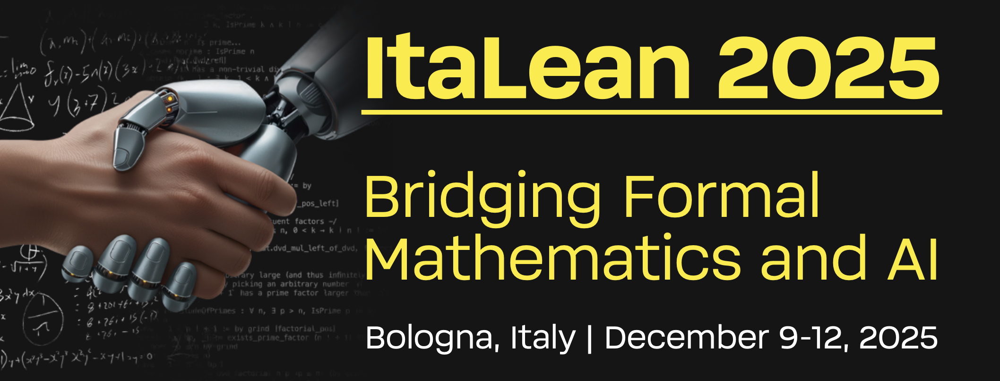

# ItaLean 2025

This repository contains the resources for the conference [*ItaLean 2025: Bridging Formal Mathematics and AI*](https://pitmonticone.github.io/ItaLean2025/) held in Bologna, Italy, December 9–12, 2025.

[](https://pitmonticone.github.io/ItaLean2025/)

## Install Lean 

To install Lean, please follow the instructions on the official [installation page](https://lean-lang.org/install/).

## Clone this repository

To clone this repository, please follow the instructions in the [GitHub documentation](https://docs.github.com/en/repositories/creating-and-managing-repositories/cloning-a-repository).

After successfully cloning the repository, navigate into the project directory and execute the following command to retrieve the necessary cached dependencies:

```
lake exe cache get
```

To test that everything is working correctly, you can run the following command to build the project:

```
lake build
```

## Projects

This section will list all the projects started or advanced during the conference. It will be updated as new projects are proposed and finalised.

## Resources

For further learning resources, including tutorials, books, exercises, and tools, please see the official [Lean learning page](https://lean-lang.org/learn/).
